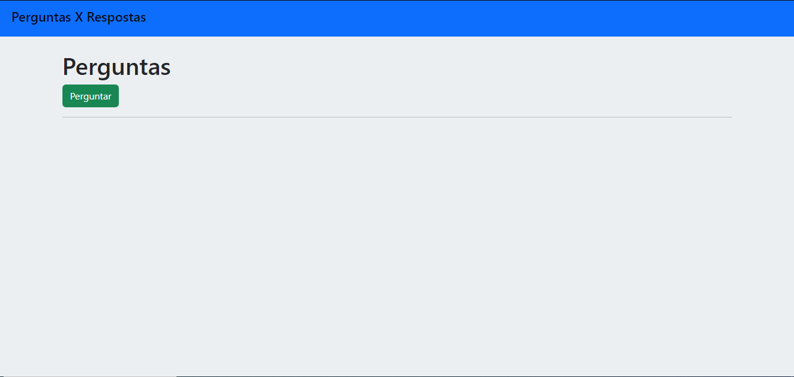
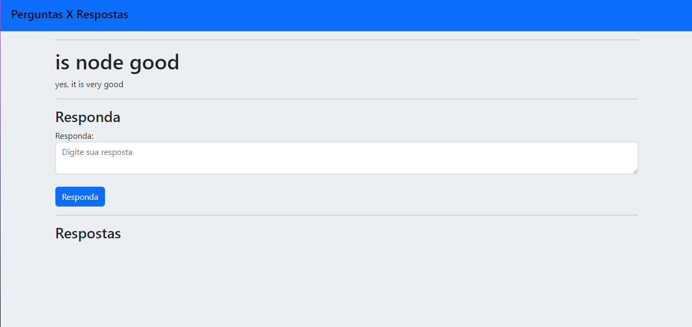
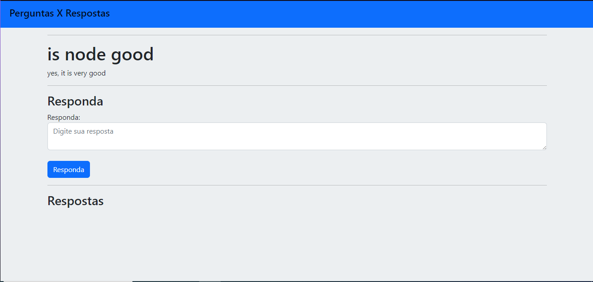

# nodets-plataforma_de_perguntas_e_respostas

### Project to create a question and answer platform
 

# Home page

## show all questions and you can make a new questions

# Question page

## listing all responses to questions and a form to save new responses

# Front
### HTML
### CSS
### Bootstrap
 

# Back
### Node
### Express
### Sequelize
 

# DB
### PostgreSQL
 

#
## Global prerequisites

`npm install -g nodemon typescript ts-node`

## Installation
`npm install`

## To run the project
`npm run start-dev`